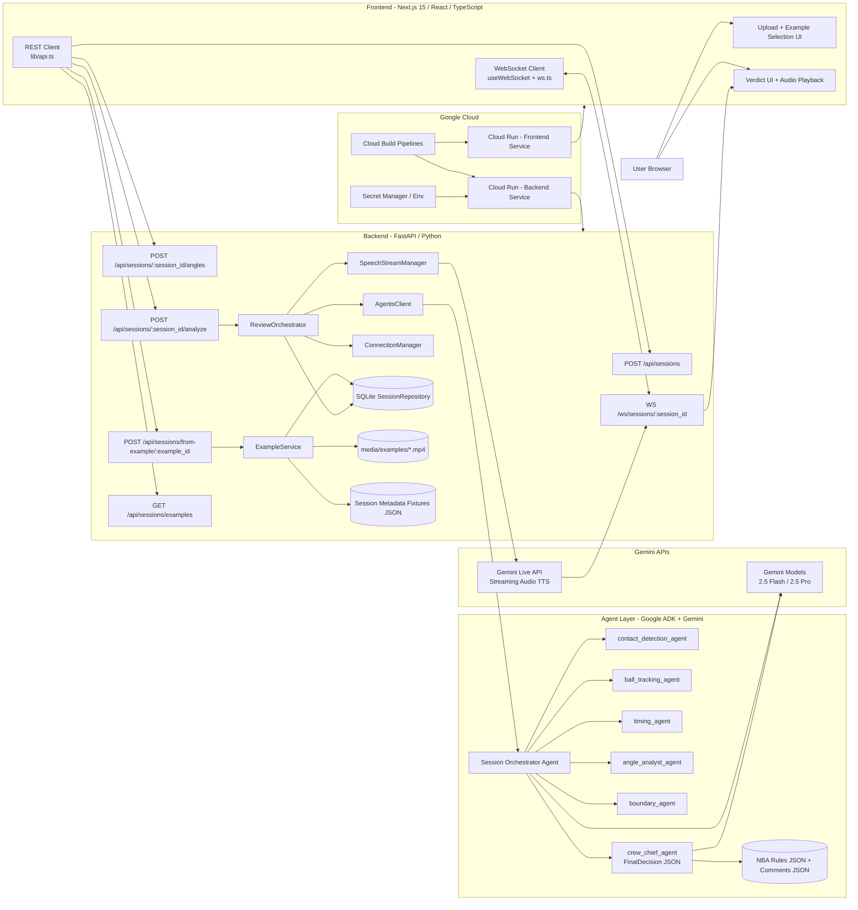
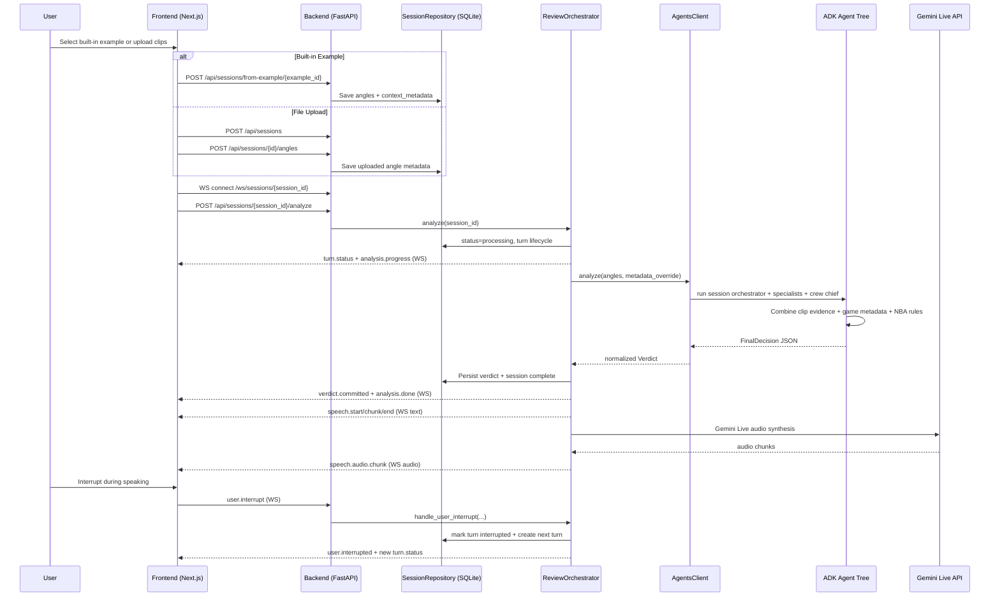

# Basketball AI Ref - Architecture Diagram

## 1) System Architecture (High Level)

## 2) Clip Analysis + Verdict Sequence

## 3) Key Grounding Inputs For Crew Chief

- Per-session game metadata (`context_metadata`) from fixture JSON or uploaded session context.
- Players on court + involved players (team, jersey, role in play).
- Call context (`call_type`, `ruling_on_floor`, whistle time, trigger).
- NBA rules corpus (`agents/prompts/nba_rules.json`) + comments (`nba_rules_comments.json`).
- Multi-angle clip evidence (timestamps, possession/contact/boundary/timing signals from specialists).
